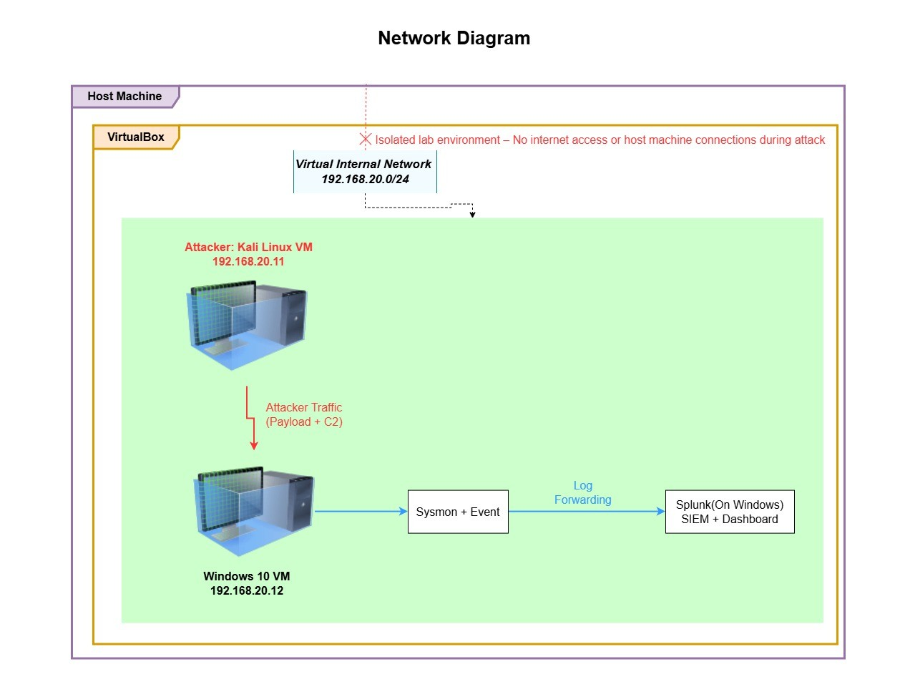

# Cyber Home Lab: Full Attack Simulation (Linux → Windows 10)

A complete home lab demonstrating a realistic attack chain using VirtualBox, Sysmon, and Splunk SIEM.

## 🎯 Project Overview
- **Hypervision*: VirtualBox
- **Victim**: Windows 10 VM with Sysmon + Splunk Universal Forwarder
- **Attacker**: Kali Linux VM
- **Simulation**: Payload deployment -> successfull invasion -> command & control visibility in Splunk

## 🛠️ Lab Architecture
- IP configuration details
- Sysmon configuration (advanced process tracking)
- Splunk dashboard for detection

## 🚀 Attack Walkthrough
1. Payload creation on Kali
2. Delivery & execution on Windows 10
3. Command execution visibility in Splunk

**Screenshots:**
![Splunk Alert]
