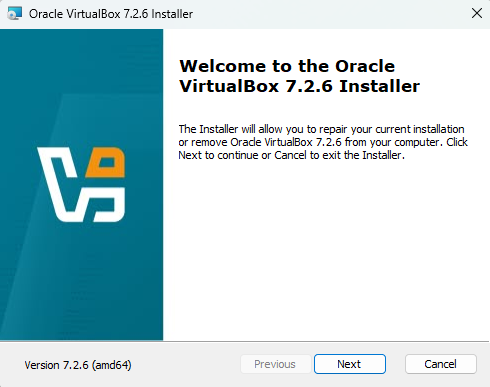
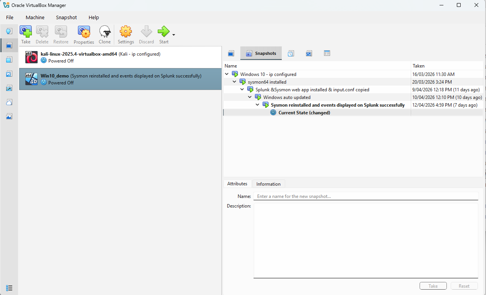

# Lab Setup Steps

Detailed guide to reproduce the **Cyber Home Lab: Kali Linux Attacker -> Windows 10 Victim with Sysmon + Splunk**.

**Estimated time**: 4-5 hours

**Difficulty**: Beginner-Intermediate

**Requirements**: A computer with at least 16 GB RAM (8 GB minimum) and 50+ GB free disk space.

## 1. Install VirtualBox (Hypervisor)

- Download the latest VirtualBox from the official site: https://www.virtualbox.org/wiki/Downloads
- Install VirtualBox
- Recommended settings: 
    - Default VM folder on a fast drive (SSD)
    - Enable "Shared Clipboard" and "Drag and Drop" (Bidirectional) for convenience

**Screenshots**: 

## 2. Congigure Virtual Networking (Very Important)

- Create a **Host-Only Adapter** (recommended for isolation) or use **Internal Network**
- Set up a dedicated network (e.g., 192.168.88.0/24)
- Disable DHCP if you want static IPs (or enable it)
- Internal network is the network mode used for my VMs, because they only need to communicate with each other and don't need any connections to internet and host machine. 

**IPs used for VMs**:
- Kali Linux Attacker: '192.168.20.11'
- Windows 10 Victim: '192.168.20.12'

## 3. Create and Configure the VMs

### Kali Linux Attacker VM
- ISO download https://www.kali.org/get-kali/#kali-virtual-machines Version: Kali GNU/Linux Rolling
- Recommended specs: 4 GB RAM, 2 CPU cores, 20-40 GB disk
- Network adapter: Internal Network mode
- Install the OS
- Post-install steps: update and set static IP.

### Windows 10 Victim VM
- ISO download from https://www.microsoft.com/en-us/software-download/windows10 
- Recommended specs: 6-8 GB RAM, 2-4 CPU cores, 40-60 GB disk
- Network adapter: Set NAT network mode if downloads needed. It is default to Internal Netowrk most of the time. 
- Install Windows 10 
- Activation is not madatory for home lab use, but type the activation key in if needed. 
- Set static IP, hostname, disable Windows Defender temporarily for testing and Firewall.

## 4. Install Monitoring Tools on windows 10 

- **Sysmon** installation: 
    - Configure NAT network -> Download from Microsoft Sysinternals -> https://learn.microsoft.com/en-us/sysinternals/downloads/sysmon and sysmonconfig.xml from https://github.com/olafhartong/sysmon-modular/blob/master/sysmonconfig.xml
    - Command to install: 'sysmon64.exe -accepteula -i sysmonconfig.xml' in Powershell with administrator privilege.  
**Splunk Enterprise**
    - Download link: https://www.splunk.com/en_us/download/splunk-enterprise.html Version: 10.2.1
    - Installation steps
    - Configuration (`inputs.conf` to monitor Sysmon logs, Security logs, etc.)
    - Create index (e.g., `victim-endpoint`)
    

## 5. Final Lab Preparations

- Take **VM snapshots** for both before any attack with clear description: e.g., "Sysmon Installed", "Splunk Installed".
- Verify network conectivity between Kali and Windows like `ping` in terminal. 
- Install `Splunk Add-on for Sysmon` web app (mandatory) and any other needed tools
- Basic hardening / isolation notes (no internet on victim during attacks, etc.)

## 6. Verification

- Commands to check:
    - `ipconfig` (Windows) / `ifconfig`(Kali)
    - Open `Services` window to verify both Sysmon and Splunk services are running

---
    
**Next**: Go to [attack-walkthrough.md](attack-walkthrough.md) for the actual payload simulation, invasion, and Splunk detection steps.